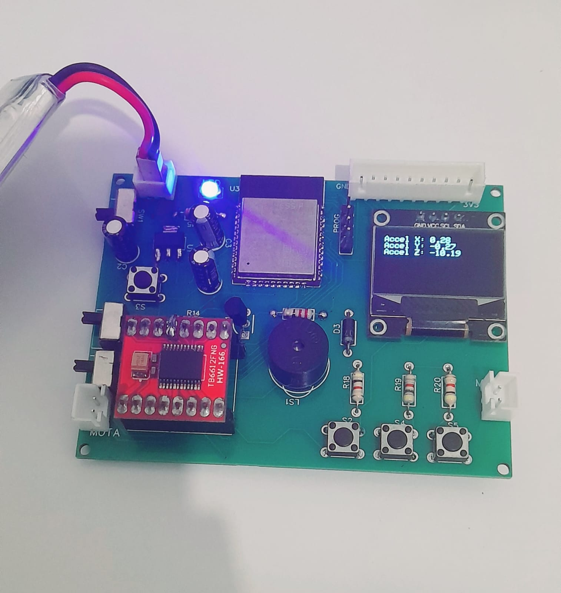
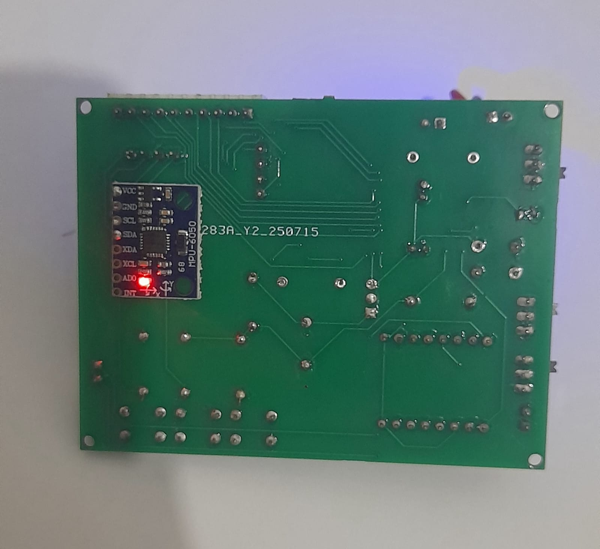
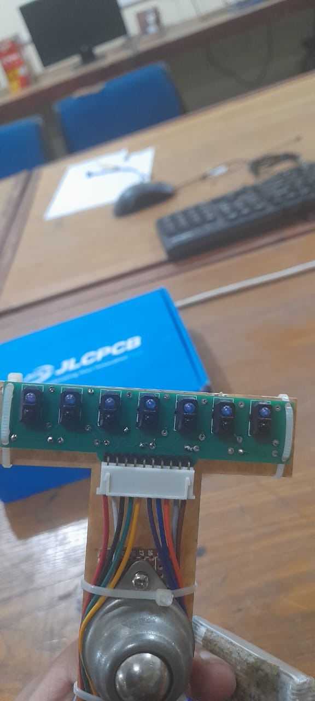
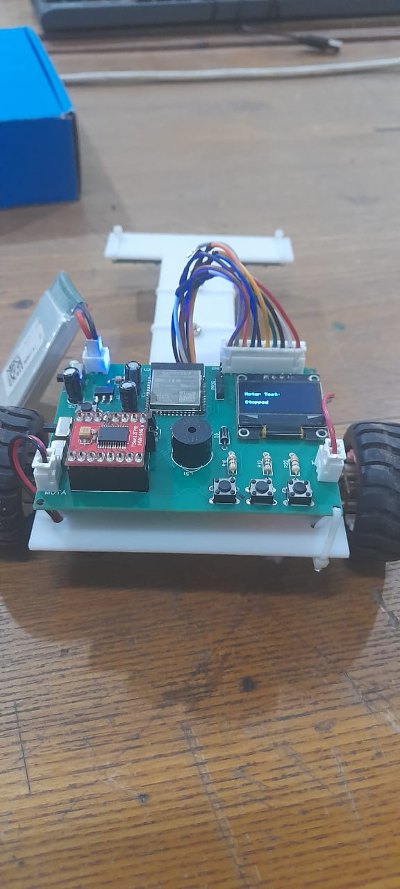
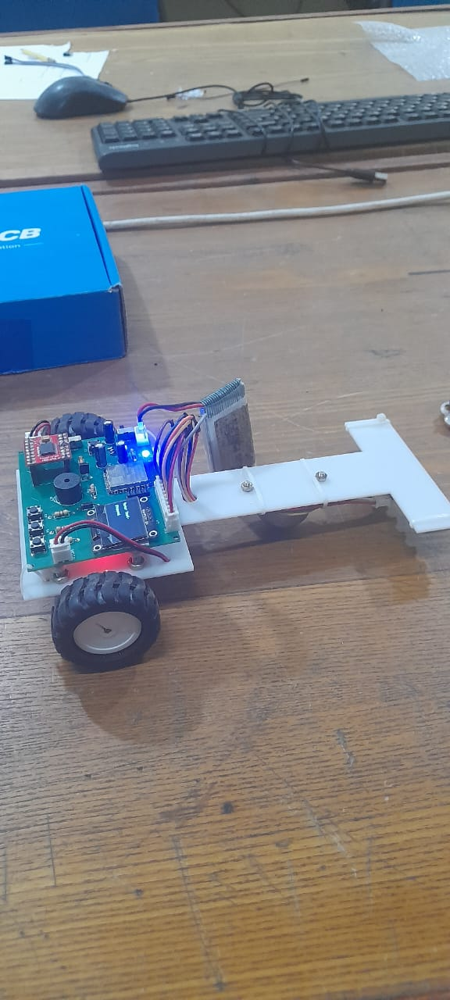
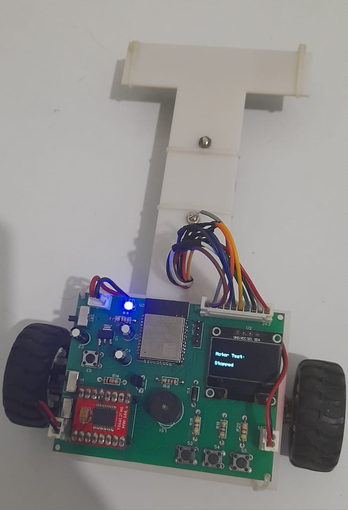

# 🚗 Line Following Robot Kit – Project-Based Learning Platform

The **Line Following Robot Kit** is a foundational learning platform developed to promote **project-based education** in **Embedded Systems**, **IoT**, and **Autonomous Robotics**. This kit provides an applied learning experience through real-time control, sensor integration, and intelligent feedback systems using the **ESP32** microcontroller.

---

## 🎯 Project Overview

This project is a part of my ongoing initiative to develop accessible, hands-on tools for learners and developers. The goal is to enable users to:

- Gain practical experience with **Embedded C/C++** on the ESP32
- Understand key concepts in **motor control and PID algorithms**
- Interface and calibrate **infrared sensor arrays** for path detection
- Build and iterate a working robot system in a structured learning flow

---

## ⚡ Core Features

- 🔌 **Controller:** ESP32 (Wi-Fi + Bluetooth capable)
- 🧭 **Navigation:** 8-channel QTR IR sensor array for line tracking
- ⚙️ **Motor Driver:** TB6612FNG dual-channel motor controller
- 📊 **Control System:** Implemented PID controller for accurate and stable motion
- 🖥️ **Display Module:** I2C OLED (optional) for real-time PID tuning and debugging
- 🧪 **Modular Design:** Designed to scale with educational use cases and experiments

---

## 🛠️ Hardware Design

### Custom PCB

---

## 📦 Kit Components

| Component           | Description                        |
|---------------------|------------------------------------|
| ESP32 Dev Board     | Primary processing unit            |
| QTR Sensor Array    | Line detection and positioning     |
| TB6612 Motor Driver | Dual-channel DC motor driver       |
| DC Motors + Wheels  | Differential drive system          |
| 7.4V Battery Pack   | Portable power supply              |
| OLED Display (I2C)  | Optional user interface (real-time)|
| Robot Chassis       | Base structure for assembly        |
| Jumper Wires        | Electrical connectivity            |

---

## 🚀 Robot Development

### Assembly Process

### Testing Phase

### Final Result

